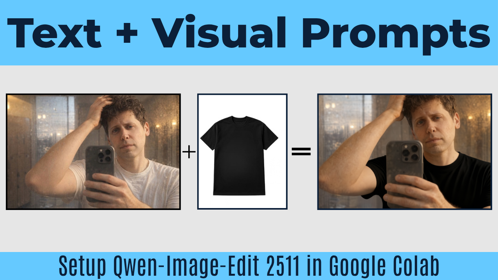

# ⚡ Qwen-Image-Edit 2511 in Google Colab

This repository provides a simple, interactive Google Colab notebook to run **Qwen-Image-Edit 2511**. Built on ComfyUI, this tool allows you to upload an image and use text prompts (along with an optional second reference image) to seamlessly edit it. It is highly optimized, utilizing GGUF models and a built-in Lightning LoRA to run blazingly fast on a free Google Colab T4 GPU.

**🎥 Watch the Tutorial:** [How to Use](https://www.youtube.com/watch?v=soon)

**🚀 Run in Colab:** [Open Google Colab Notebook](https://colab.research.google.com/drive/1cJDb0mWwAXAQRB48rwRbSkl82oSfGKd_?usp=sharing)

---

## ✨ Features Supported in this Notebook

This notebook automates the setup process into 3 simple cells:

1. **⚙️ Initialize Core Environment**: Installs ComfyUI, `uv` package manager, and custom GGUF processing nodes required for Qwen-Edit.
2. **📥 High-Speed Asset Downloader & LoRA Setup**: Uses Aria2c to rapidly download the heavily optimized `Qwen-Image-Edit-2511-Q3_K_M.gguf`, FP8 Text Encoders, VAE, and a specialized 4-step Lightning LoRA. It also supports downloading or uploading custom LoRAs.
3. **🎨 Qwen-Image-Edit Generation**: The main editing engine. Features include:
   * **Dual Image Uploads**: Upload 'Image 1' as your target to edit, and an optional 'Image 2' as a visual reference (e.g., for matching clothes or styles).
   * **Smart Resizing**: Automatically outputs the edited image at the exact native dimensions of Image 1.
   * **Lightning Speed**: Toggle `USE_LIGHTNING_LORA` to force 4 steps and CFG 1.0, delivering edits in just 30-120 seconds on a T4 GPU.
   * **Advanced Tuning**: Sliders for Steps, CFG, Aura Shift, and Seed control.
   * **Auto-download**: Save your final masterpiece directly to your device.

## 🛠️ How to Use

1. Click the "Open in Colab" badge above.
2. Go to **Runtime > Change runtime type** and ensure a **T4 GPU** is selected.
3. Run **Cell 1** to initialize the ComfyUI core environment and dependencies.
4. Run **Cell 2** to download the required models. You can also specify a custom LoRA URL here if desired. 
5. Go to **Cell 3**. 
   * Ensure `UPLOAD_IMAGE_1` is checked. Check `UPLOAD_IMAGE_2` if you have a visual reference.
   * Type your editing instructions in the `PROMPT` box (e.g., "Change the clothes of the person in image 1 to match the outfit in image 2").
   * Hit the Play button and upload your image(s) when the prompt appears.
   * The server will process your image in the background, and your newly edited image will appear below the cell!

## 🤝 Credits
* **Notebook Creator:** [@CoinNoin](https://www.youtube.com/@CoinNoin)
* **Base Model (GGUF):** [Unsloth / Qwen-Image-Edit-2511-GGUF](https://huggingface.co/unsloth/Qwen-Image-Edit-2511-GGUF)
